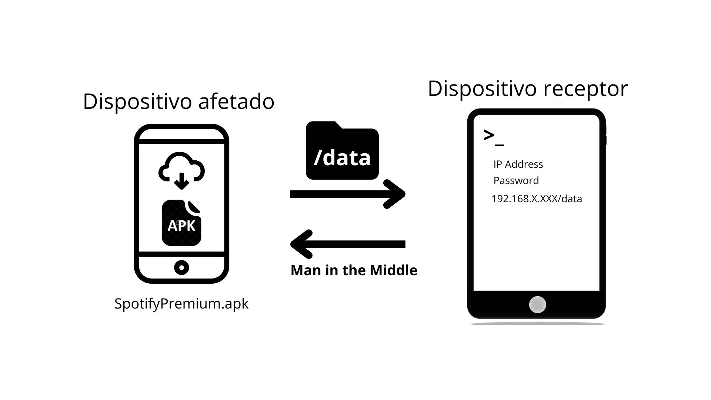

# Tentativa de criação de aplicativo malicioso

Encontra-se pela internet muitos APKs com modificações em relação as suas versões originais, abrigando conteúdos premium de maneira gratuita. Pensamos em simular uma situação onde,
1. Um usuário instala o APK malicioso em seu dispositivo, acreditando que é uma versão do aplicativo esperado;
2. Aceita todas as permissões de acesso;
3. No momento em que aceita as permissões, todos os seus dados são copiados para um dispositivo receptor automaticamente,  que estava em modo *listening* ;
4. Sua troca de pacotes passa a ser observada também pelo dispositivo receptor, por meio de um ataque Man in the Middle.

No código-fonte do próprio aplicativo malicioso, os comandos convenientes para o ataque já seriam executados, como:
- Abertura de servidor SSH;
- Envio de credenciais para o dispositivo receptor;
- Transferência de arquivos locais;
- Brecha para ataque Man in the Middle.

