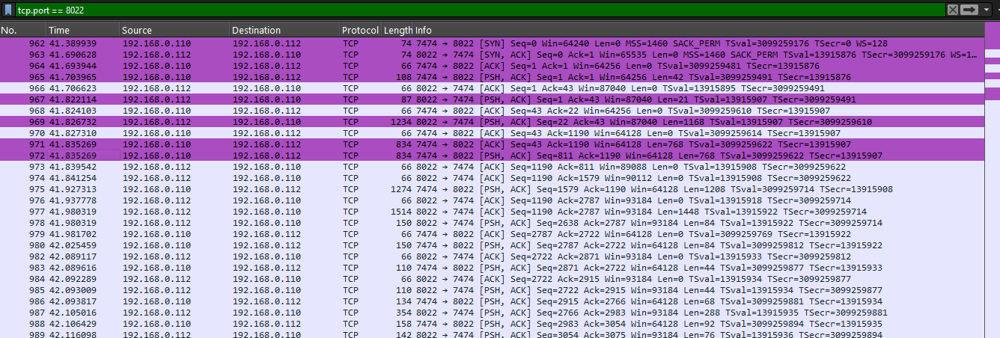
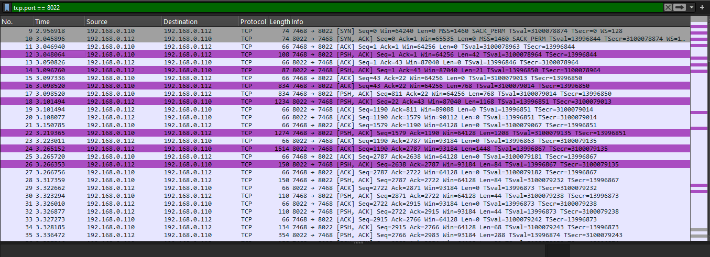
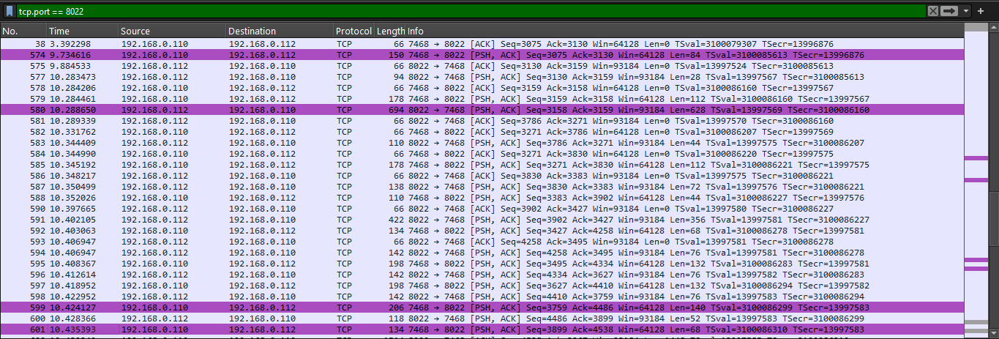

# Análise da transmissão de pacotes pelo Wireshark

## No momento da conexão

### O que acontece depois do handshake?
- **Criptografia simétrica:** A comunicação entre o cliente e o servidor é protegida por criptografia simétrica (usando a mesma chave para criptografar e descriptografar os dados), que é muito mais eficiente do que a criptografia assimétrica (onde as chaves públicas e privadas são usadas, como durante o handshake).

- **Criptografia de dados:** Uma vez que a chave simétrica é estabelecida durante o handshake, todos os dados transmitidos entre o cliente e o servidor são criptografados, tornando-os ilegíveis para qualquer outra pessoa que tente interceptar a comunicação (por exemplo, um possível man-in-the-middle). Isso garante a confidencialidade dos dados.

- **Autenticidade e integridade:** Além da criptografia, o SSH usa assinaturas digitais e códigos de autenticação de mensagem (MACs) para garantir que os dados não foram alterados (integridade) e que a comunicação realmente está acontecendo entre as partes esperadas (autenticidade).
## Transferência de arquivo (SCP)
Comando para copiar um arquivo do servidor SSH para o dispositivo local:
```plaintext
scp -P 8022 u0_XXX@192.168.X.XXX:/caminho/arquivo /caminho/destino/
```


